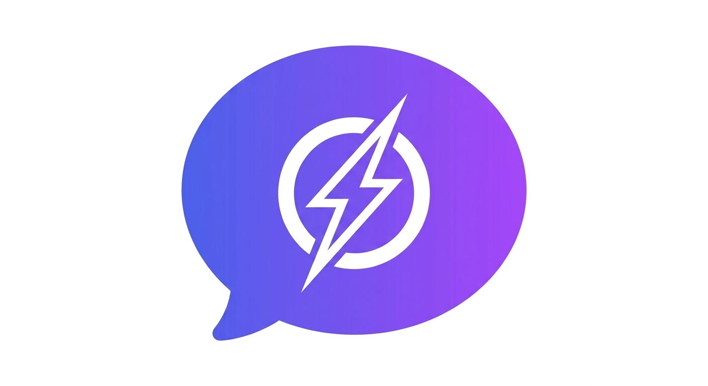
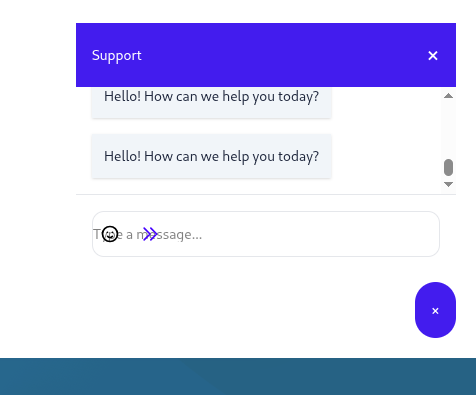
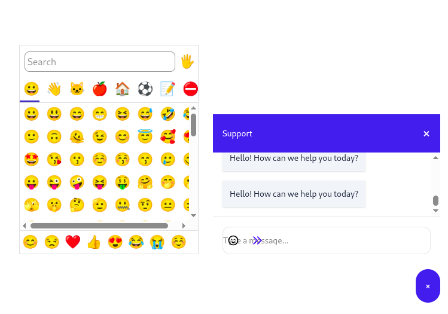

<p align="center">
  
</p>

<h1 align="center">AnyChat 💬</h1>

<p align="center">
  <strong>Lightweight. Stateless. Instant.</strong><br>
  A support-first chat widget for Laravel, powered by Livewire and Alpine.js.
</p>

<p align="center">
  
   
   
</p>

<p align="center">
  
  
  <a href="https://packagist.org/packages/saammi/any-chat"></a>
  <a href="https://opensource.org/licenses/MIT"></a>
</p>

---

**AnyChat** is a stateless Livewire chat widget designed for Laravel applications. It enables real-time support interactions with **zero database migrations** and **zero authentication** overhead. Messages persist in the local session, making it the perfect privacy-first solution for landing pages and lead generation.

## ✨ Key Features

* **Stateless by Design**: No database bloat. Messages stay in the user's session.
* **Plug & Play**: Zero configuration required to get started.
* **Reactive**: Built on Livewire and Alpine.js for a snappy, real-time feel.
* **Theming**: Full dark mode support and deep customization via Blade props.

## 📦 Installation

Install the package via Composer:

```bash
composer require saammi/any-chat
```

🛠 Usage
1. The Chat Widget
Place the component in your public-facing Blade templates:


```html
<x-anychat />
```

2. The Response Dashboard
Access incoming messages using the administrative dashboard component:

```html
<livewire:anychat-dashboard />
```

Prerequisites
Ensure your layout file includes the required Livewire and Alpine.js assets:

```html
<html>
<head>
    @livewireStyles
</head>
<body>
    {{ $slot }}

    @livewireScripts
    <script defer src="[https://unpkg.com/alpinejs@3.x.x/dist/cdn.min.js](https://unpkg.com/alpinejs@3.x.x/dist/cdn.min.js)"></script>
</body>
</html>
```

Setup reverb or pusher and you are good to go.


🎨 Customization
You can fine-tune the widget appearance directly through props:

```html
<livewire:anychat-widget 
    height="500px" 
    width="400px" 
    variant="outline" 
    primaryColor="#7c3aed"
    adminColor="#f3f4f6"
/>
```

🧪 Testing
We maintain a robust test suite using PHPUnit and Laravel Dusk to ensure stability across PHP and Laravel versions.

Unit Tests:
```bash
./vendor/bin/phpunit --testsuite Unit
```

Browser Tests (Dusk):
```bash
# Update ChromeDriver to match your local version
./vendor/bin/dusk-updater detect --auto-update

# Run the browser suite
./vendor/bin/testbench dusk
```

🗺 Roadmap (Beta)
[ ] File Uploads: Send images and documents via chat.

[ ] Notifications: Real-time alerts for new messages.

[ ] AI Integration: Optional support for LLM-powered auto-responders.

[ ] Database Driver: Optional persistence for long-term history.

🤝 Contributing
Contributions are what make the open-source community an amazing place to learn, inspire, and create. Any contributions you make are greatly appreciated. Please see our Contributing Guide for details.

📄 License
The MIT License (MIT). Please see the License File for more information.

